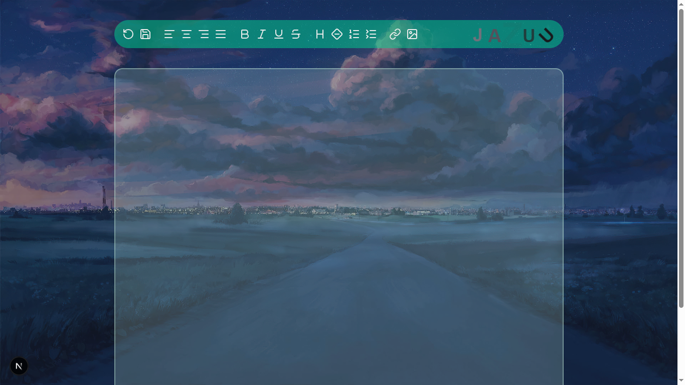
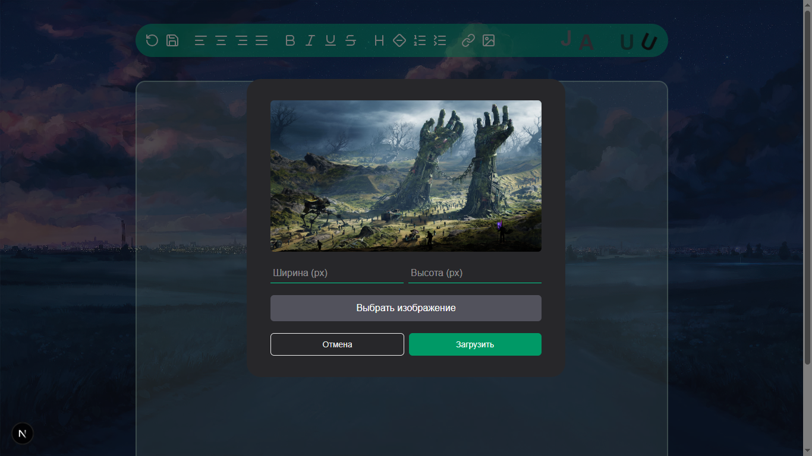
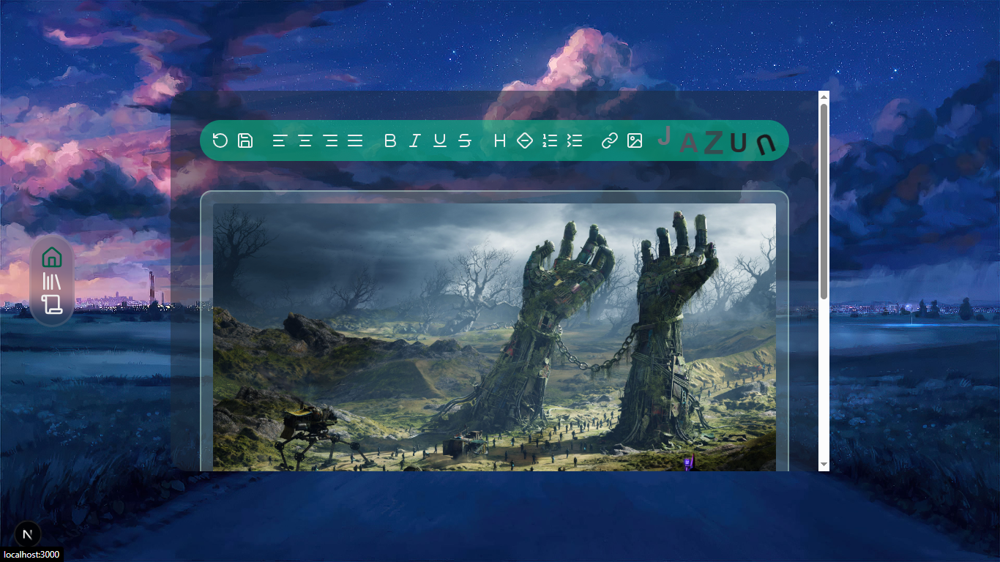

# Name Project: JAZUU

> jazuu is a project where you can write your thoughts, just write thoughts. And to develop myself as a developer!

### development process

> start --> [now] --> demo2v --> demo3v --> beta1v --> beta2v --> beta3v --> release

---

## Preview





> demostrantions

---

## Installation

```bash
git clone https://github.com/username/jazuu.git
cd jazuu
npm install
npm run dev
```
